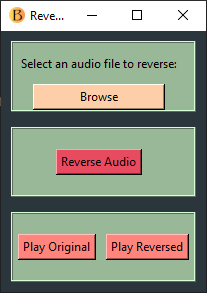

# Audio Reversal Tool

This is a Python-based GUI application that allows you to reverse audio files, with options to play both the original and reversed versions. Built using `Tkinter` for the GUI, `pydub` for audio processing, and `pygame` for playback, this project demonstrates audio file handling and a simple yet functional GUI for an interactive user experience.



## Features

- **Reverse Audio Files**: Choose any `.wav` or `.mp3` file, and the app will reverse the audio and save it as a new file.
- **Play Original & Reversed Audio**: Built-in playback for both the original and reversed files.
- **User-friendly GUI**: A clean and intuitive interface, created with `Tkinter`.
- **Error Handling & Notifications**: Informative messages guide users through actions and alert them to any errors.

## Interesting Code Highlights

1. **File Handling and Manipulation**: Leveraging `pydub`, this app can load, process, and export audio files with ease.
2. **Audio Playback with `pygame`**: The app includes audio playback functionality for both the original and reversed audio files.
3. **Dynamic GUI Structure**: The app's GUI is split into frames with different functionalities, styled and spaced for an organized appearance.
4. **Error Handling**: Includes `try-except` blocks and `messagebox` notifications to ensure a smooth user experience, even when errors occur.

## Installation

1. **Clone the Repository**:
    ```bash
    git clone https://github.com/richardsbrian/audio_rev.git
    cd audio-reversal-tool
    ```

2. **Install Dependencies**:
    Install required packages from `requirements.txt`:
    ```bash
    pip install -r requirements.txt
    ```

## Usage

1. **Run the Application**:
    ```bash
    python app.py
    ```

2. **Browse and Select an Audio File**:
   - Click **Browse** to select an audio file (`.wav` or `.mp3` format).
   
3. **Reverse the Audio**:
   - Click **Reverse Audio** to create a reversed version of the file. The output file is saved in the same directory as the original with a `reversed_` prefix.
   
4. **Play Original and Reversed Audio**:
   - Use **Play Original** to hear the unaltered audio.
   - Use **Play Reversed** to listen to the reversed audio.

## Requirements

- **Python 3.x**
- Packages listed in `requirements.txt`:
  - `pydub` for audio manipulation.
  - `pygame` for audio playback.
  - `tkinter` (usually included with Python).

## License

This project is licensed under the MIT License. See the [LICENSE](LICENSE) file for details.

## Contribution

Feel free to fork this repository and submit a pull request for improvements or new features!

---

Enjoy reversing your audio files and experimenting with this tool!

